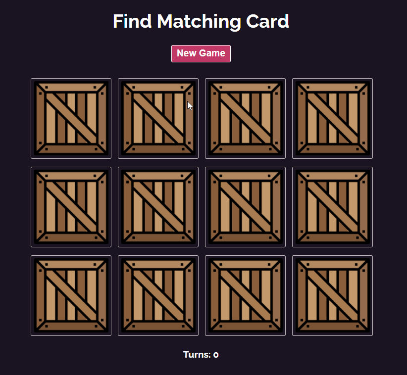

#### _Brief desc of Project, 12.07.2021_

#### By _**Roman Kolivashko**_

<html>
<!-- Project Shields -->
    

        
		  ¨
        
        ¨
        
        ¨
        
        ¨
        
    
 
</html>

---
## Table of Contents
* [Description](#description)
* [React Components Diagram](#diagram)
* [Screenshots](#screenshots)
* [Setup/Installation Requirements](#installation-requirements)
    - [Requirements to Run](#requirements-to-run)
    - [Instructions](#instructions)
    - [Other Technologies Used](#other-technologies-used)
* [How to access the app from the web](#web-access)
* [Known Bugs](#known-bugs)
* [Support and Contact Details](#support-and-contact-details)
* [License](#license)
---
## Description 
This applications is a simple memory card game, built with React. Lets users select two cards at a time, in attempt to match the pair.

## Screenshots 

## Setup/Installation Requirements 

### Requirements to Run 
* _Web Browser_
* _Webpack_
* _Node.js_
* _NPM_

### Instructions 

1. Download and install Node.js from the [official website](https://nodejs.org/en/download/)
2. Clone the repository: `$git clone https://github.com/romankolivashko/memory-game.git`
3. Use command line/Bash to move to the project directory with `cd project-directory`
4. Run `npm install` to get all dependencies. 
5. Run `npm run start` to start up the project

## Other Technologies Used 

* _HTML_
* _CSS_
* _Javascript_
* _React_
* _React Hooks_
* _ESLint_
* _Babel_
* _Markdown_

## How to access the app from the web 
* _Follow the link [here](https://amazing-yalow-31fb26.netlify.app/)_ 

## Known Bugs 

There are currently no known bugs in this program.
If found, please report it here - [Issues](https://github.com/romankolivashko/memory-game/issues)

## Support and contact details 

_If there are any question or concerns please contact me at my [email](mailto:rkolivashko@gmail.com). Thank you._

### License 

*This software is licensed under the MIT license*